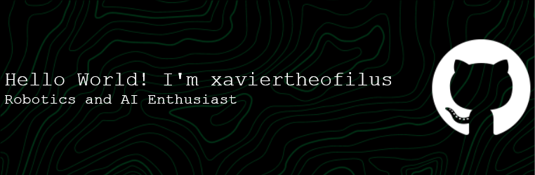

## Hello World! 👋

👋 Hi, I’m Xavier! I have over 1 years of professional experience,specializing in Python programming, Robotics Automation, IoT, and AI implementation.

📚 I hold a Barchelor of Engineer in Robotics and AI, where I focused on Applied AI and Project Management.

##### 🛠 Skills:

##### 🎮 Interests:

##### 🌍 Connect with me!
 

##### 📊 My Github Stats

